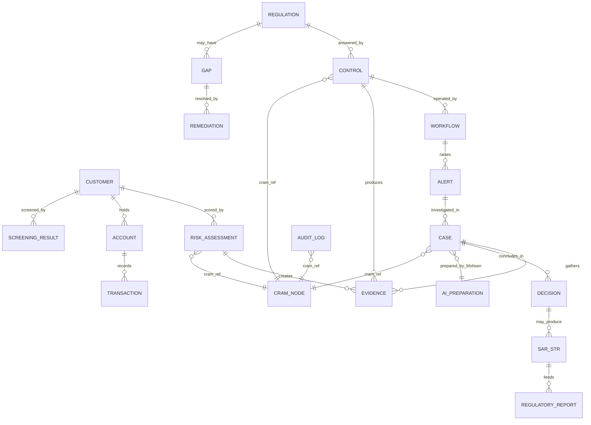
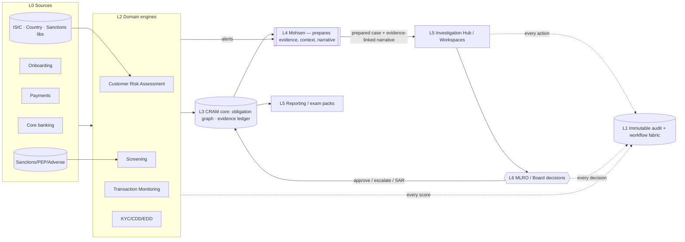

# Mal FinCrime OS — Product Architecture Blueprint
### A next-generation Financial Crime Compliance Platform with the CRAM as its central intelligence engine

**Prepared as:** Chief Product Architect · AML/CFT SME · UX/UI Design Lead · Enterprise FinCrime Technology Consultant
**For:** Mal — MLRO, Compliance Officers, Financial Crime Analysts, Internal Audit, Risk, Senior Management
**Design north star:** the usability of Lucinity & Unit21, the enterprise governance & regulatory depth of NICE Actimize, SAS AML and Oracle FCCM — with the **CRAM as the single source of truth** across the platform.
**Operating philosophy:** *AI prepares the work. Humans review, validate, and decide.* (Mohsen, powered by Claude, is the preparation layer; the MLRO and team own every decision.)

> One sentence to hold the whole platform together: **every regulatory obligation becomes a living thread — Requirement → Control → Workflow → Evidence → Monitoring → Investigation → Reporting → Continuous Improvement — and the CRAM is the loom on which every thread is woven, inspected and proven.**

---

## 0. How to read this blueprint
Section 1 sets the concept and the two metaphors that keep it coherent. Sections 2–4 are the architecture (system, information, navigation, modules). Section 5 is screen-by-screen design. Sections 6–11 are the operating model: journeys, CRAM integration, the end-to-end workflow, the entity model, data flows and the AI interaction model. Section 12 gives the compliance rationale for every major feature. Section 13 recommends the additional modules that take this from "very good" to "world-class."

### The two metaphors (kept deliberately separate so nothing competes)
- **The CRAM is the brain / control room.** It holds the model of the world: what the law requires, which control answers it, which risk it touches, what evidence proves it, and where the gaps are.
- **The platform is the waterworks / circulatory system.** Source water (regulations, methodology, ISIC, country & sanctions libraries, detection signals) flows through governed pipes to every customer, case and report — and a tamper-proof meter records every drop. This is the same pipe language as Mal's existing console and Lucinity's preparation pipeline; we use it as the platform's *visual signature*, never as decoration over wrong numbers.

These are one conceit, not two: the brain decides *where* water should go; the waterworks *carries it there and proves it arrived*.

---

## 1. Concept: the CRAM as the central intelligence engine

In this platform the **CRAM (Compliance Risk Assessment Matrix)** is broader than the customer-risk scoring methodology Mal has already built — that methodology becomes one **engine node** inside it. The CRAM is the **graph that connects obligation to evidence**:

```
        ┌────────────┐    answered by   ┌──────────┐   operated by   ┌──────────┐
        │ REGULATION │ ───────────────► │ CONTROL  │ ──────────────► │ WORKFLOW │
        │ (CBUAE,    │                  │ (policy, │                 │ (system  │
        │  FATF,     │ ◄─ mapped to ──  │  rule,   │                 │  module) │
        │  Wolfsberg)│                  │  check)  │                 └────┬─────┘
        └────────────┘                  └────┬─────┘                      │ produces
              ▲ measured by                  │ tests                      ▼
        ┌─────┴──────┐  feeds   ┌────────────▼───┐   triggers   ┌────────────────┐
        │ REPORTING  │ ◄─────── │   MONITORING   │ ───────────► │ INVESTIGATION  │
        │ & MI/KRI   │          │ (TM, screening,│              │ (case, SAR/STR)│
        └─────┬──────┘          │  CRA, KYC)     │              └───────┬────────┘
              │ informs         └────────────────┘                      │ evidences
              ▼                         ▲                               ▼
        ┌───────────────────────────────┴───────────────────────────────────┐
        │   CONTINUOUS IMPROVEMENT  (gaps, audit findings, calibration)       │
        └────────────────────────────────────────────────────────────────────┘
```

Every object in the platform — a control, a screen, an alert, a case, a SAR, a KRI, an audit finding, an AI recommendation — **carries a CRAM reference** so it can be traced upward to the obligation it serves and downward to the evidence that proves it. Nothing exists in the platform that doesn't map to the CRAM. That single rule is what makes the platform audit-ready and explainable by construction.

### The five jobs the CRAM does for the MLRO
1. **Understand** — one picture of obligations, controls, risks and gaps.
2. **Manage** — turn each obligation into an owned, scheduled, evidenced control.
3. **Reduce** — surface gaps and weak controls; route remediation; re-test.
4. **Monitor** — live control-effectiveness, risk distribution, emerging typologies.
5. **Evidence** — assemble a regulator-ready pack for any obligation in minutes.

---

## 2. Overall platform architecture (logical layers)

Adopting the Human AI Operations stack (Governance on top, execution beneath, detection/core at the base) and Mal's separation of *risk definition* from *execution*:

```
┌──────────────────────────────────────────────────────────────────────────────┐
│ L6  GOVERNANCE & OVERSIGHT      Risk appetite · policy · thresholds · approvals │  ← institution owns
│      (MLRO, Board, Audit)        SAR decisions · model governance · sign-off    │
├──────────────────────────────────────────────────────────────────────────────┤
│ L5  EXPERIENCE LAYER            Executive Dashboard · CRAM Workspace ·          │
│      (role-based UIs)            Regulatory Mgmt · Investigation Hub · Reporting │
├──────────────────────────────────────────────────────────────────────────────┤
│ L4  HUMAN-AI PREPARATION        Mohsen (powered by Claude): evidence collection, │  ← prepares, never decides
│      (the "Luci" layer)         contextualization, behaviour interpretation,    │
│                                  explanation, narrative, reasoning-trace         │
├──────────────────────────────────────────────────────────────────────────────┤
│ L3  CRAM CORE  (the brain)      Obligation graph · control library · risk       │  ← single source of truth
│                                  taxonomy · evidence ledger · lineage engine     │
├──────────────────────────────────────────────────────────────────────────────┤
│ L2  DOMAIN ENGINES              Customer Risk Assessment (the model already      │
│                                  built) · Screening · Transaction Monitoring ·   │
│                                  KYC/CDD/EDD · Case · Onboarding · Fraud          │
├──────────────────────────────────────────────────────────────────────────────┤
│ L1  WORKFLOW & CONTROL FABRIC   Non-bypassable workflows · maker-checker ·       │  ← governance enforced
│      (the "FinCrime OS")         RBAC/SoD · immutable audit · event bus · SLAs    │  structurally, not by habit
├──────────────────────────────────────────────────────────────────────────────┤
│ L0  DATA & INTEGRATION          Core banking · onboarding · payments · lists     │
│                                  (sanctions/PEP/adverse) · ISIC · country libs    │
└──────────────────────────────────────────────────────────────────────────────┘
```

**Architectural invariants** (carried from everything Mal has built, now platform-wide):
- **Governance is enforced structurally, not procedurally.** Required steps cannot be skipped; the hard-stop rules (OVR-001…007) are welded shut; downgrades need MLRO sign-off.
- **AI prepares, humans decide.** Mohsen (L4) never makes a risk decision; it assembles evidence and drafts reasoning that a human validates.
- **Immutable, reproducible audit.** Every record stores its inputs, model/library versions, the actor, and the CRAM reference; nothing is overwritten.
- **Reversible & continuity-safe.** Data, workflows and case history stay with Mal; a documented break-the-glass path lets internal teams resume from prepared cases, not raw alerts.

---

## 3. Information architecture & navigation

### 3.1 Primary navigation (left rail — role-aware)
```
◎ Mal FinCrime OS
├─ ⬡ Executive Dashboard          "What needs me this morning"
├─ ◳ CRAM Workspace               the brain: regulation → control → evidence
│   ├─ Obligation Library
│   ├─ Control Library
│   ├─ Risk & Heat Maps
│   ├─ Regulatory Lineage (graph)
│   └─ Gap & Coverage
├─ § Regulatory Management        browse · track · impact · remediation
├─ ⚖ Risk Assessments             Customer Risk (CRA) · Enterprise-Wide (EWRA) · Product/Channel
│   ├─ Customer Risk Assessment   ← the engine Mal already built (NP/LP/FI…)
│   ├─ Enterprise-Wide Risk
│   └─ Methodology & Model Gov
├─ ⌖ Screening & Monitoring        sanctions · PEP · adverse media · name · TM
├─ ⚑ Investigation Hub            triage → investigate → decide → SAR/STR
│   ├─ My Queue / Team Queue
│   ├─ Case Workspace
│   └─ SAR/STR Centre
├─ ◷ Onboarding & Lifecycle        digital onboarding · CDD · EDD · periodic review
├─ ▤ Reporting Centre              board · regulator · MI · KRI · audit · exam packs
├─ ⊞ Domains                       Fraud · CPF · Training · Policy Mgmt
├─ ⌘ Mohsen (AI)                    omnipresent assistant (powered by Claude)
└─ ⚙ Governance & Admin            RBAC · config maker-checker · model versions · audit log
```

### 3.2 IA principles
- **Three-click rule to evidence.** From any obligation, control, alert or KPI the user can drill to the underlying evidence in ≤3 clicks (the CRAM lineage makes this deterministic).
- **Consistent object shell.** Every object page shares the same anatomy: *header (identity + CRAM ref + status) · body (the work) · right rail (AI prep + tasks + audit) · footer (decision + sign-off)*. Learn one page, know them all — minimal learning curve.
- **Role-aware, not role-locked.** An Executive sees the dashboard first; an Investigator sees their queue first; the MLRO sees everything. Same data, different default lens.
- **Context travels.** Selecting a customer anywhere carries that context (its CRA rating, open cases, screening status) into every other module.

---

## 4. Module hierarchy & how each maps to the CRAM

| # | Module | Primary user | CRAM role (what it reads / writes) |
|---|--------|--------------|-----------------------------------|
| 1 | Executive Dashboard | MLRO, Exec, Board | Reads CRAM health, gaps, KRIs; writes nothing (a lens) |
| 2 | CRAM Workspace | MLRO, Compliance | The brain itself — authors obligations↔controls↔risks↔evidence |
| 3 | Regulatory Management | Compliance | Tracks regulation lifecycle; raises gaps & remediation into CRAM |
| 4 | Risk Assessments (CRA/EWRA) | Analyst, MLRO | The scoring engines; write customer/enterprise risk back to CRAM |
| 5 | Screening & Monitoring | Analyst | Controls that test obligations; emit alerts → Investigation |
| 6 | Investigation Hub | Investigator, MLRO | Consumes alerts; produces evidence, decisions, SAR/STR → CRAM |
| 7 | Onboarding & Lifecycle | Ops, Analyst | Executes CDD/EDD controls; feeds CRA & screening |
| 8 | Reporting Centre | MLRO, Exec, Audit | Reads everything; produces regulator/board/exam outputs |
| 9 | Domains (Fraud/CPF/Training/Policy) | Various | Each is a set of controls/obligations in the same CRAM |
| 10 | Mohsen (AI) | All | Preparation layer across every module (L4) |
| 11 | Governance & Admin | MLRO, Admin, Audit | Owns RBAC/SoD, config maker-checker, model versions, audit |

The Customer Risk Assessment engine, the ISIC activity map, the country/sanctions libraries and the override rules already built **slot in as Module 4 + its reference data** — no rework; they become the first fully-wired CRAM nodes.

---

## 5. Screen-by-screen design concepts

For each screen: **Purpose · Primary user · Navigation flow · Key widgets · Visual hierarchy · Data relationships · Interactions · Drill-down · Filters · AI assistance · Compliance rationale.**

### 5.1 Executive Dashboard — "What needs me this morning"
- **Purpose:** in one screen, the MLRO knows the health of the whole programme and the three things only they can resolve today.
- **Primary user:** MLRO (Executive/Board read-only variant).
- **Navigation flow:** default landing → click any tile to drill into its source module.
- **Key widgets:** (a) **CRAM Health gauge** (composite of control effectiveness, coverage, overdue items); (b) **Regulatory Compliance Score** with trend; (c) **Open Risks & Critical Alerts** with severity; (d) **Control Effectiveness** heat strip; (e) **Regulatory Gaps** count + worst offenders; (f) **Emerging Typologies** (AI-surfaced); (g) **Investigations** funnel (L1→L2→SAR); (h) **Suspicious-activity stats**; (i) **Board KPIs**; (j) **Regulatory deadlines** calendar; (k) **AI-generated priorities** ("Mohsen suggests you action these 3").
- **Visual hierarchy:** health + score top-left (the "is the programme OK?" answer); AI priorities top-right (the "what do I do?" answer); operational tiles below.
- **Data relationships:** every tile is a saved CRAM query; clicking carries its filter into the target module.
- **Interactions / drill-down:** click "Gaps: 6" → Regulatory Management filtered to open gaps; click a typology → Investigation Hub filtered to matching behaviour.
- **Filters:** entity/segment, business line, region, time window, risk band.
- **AI assistance:** Mohsen writes a 3-line **morning brief** and a prioritised action list, each linked to evidence.
- **Compliance rationale:** gives the MLRO demonstrable, daily oversight — the supervisory expectation that the accountable person actively monitors the programme.

### 5.2 CRAM Workspace — the brain
- **Purpose:** author and explore the obligation→control→risk→evidence graph; see coverage and gaps; drill from any regulation to the evidence that proves it.
- **Primary user:** MLRO, senior Compliance.
- **Key widgets:** (a) **Interactive lineage graph** (regulation nodes → control nodes → module/workflow nodes → evidence nodes; click a node to expand); (b) **Risk matrix / heat map** (likelihood × impact, or inherent × residual); (c) **Coverage meter** (obligations with ≥1 effective control vs uncovered); (d) **Control register** table; (e) **Regulatory lineage breadcrumb** (CBUAE Art. X → Policy §Y → Control C-123 → TM scenario → Case → SAR).
- **Visual hierarchy:** the graph dominates; matrices and registers are the analytical companions.
- **Data relationships:** the canonical join table of the platform — everything else references rows here.
- **Interactions / drill-down:** click a regulation → see its controls, their effectiveness, last test date, owner, evidence; click "uncovered" → raise a gap (routes to Regulatory Management with maker-checker).
- **AI assistance:** Mohsen proposes **control mappings** for a new/changed regulation and flags **likely gaps** ("this CBUAE notice has no mapped control") — as suggestions a human ratifies.
- **Compliance rationale:** this is the artefact a regulator most wants to see — provable, current mapping from law to control to evidence, with gaps owned and tracked.

### 5.3 Regulatory Management
- **Purpose:** browse regulations, track implementation, watch for regulatory change, assess impact, assign and evidence remediation.
- **Key widgets:** regulation browser (CBUAE, FATF, Wolfsberg, internal policies); **implementation-status** Kanban (Identified → Mapped → Implemented → Tested → Evidenced); **regulatory-change feed**; **impact assessment** worksheet; remediation tasks with SLA; evidence locker.
- **AI assistance:** Mohsen summarises a new regulation, drafts an **impact assessment**, and proposes affected controls — human reviews.
- **Compliance rationale:** demonstrates horizon-scanning and timely implementation of regulatory change — a core supervisory expectation.

### 5.4 Risk Assessments (Customer Risk + Enterprise-Wide)
- **Purpose:** run and evidence risk scoring; this is where Mal's existing CRA engine lives.
- **Key widgets:** the **assessment workspace** (segment/lifecycle, the A–H sections, live composite "pressure" gauge, override/floor panel, four outcomes, explainability receipt — exactly the mock already built); **EWRA** roll-up (portfolio inherent vs residual by typology/geography/product); **methodology & model governance** (versions, open items, the band-boundary ratification, validation gates).
- **AI assistance:** Mohsen pre-fills parameters from source data, resolves ISIC activity, explains *why* a rating landed, and flags data-quality blockers — never overriding a floor.
- **Compliance rationale:** the risk-based approach made operational and reproducible; ties customer risk directly to CDD/EDD intensity.

### 5.5 Screening & Monitoring
- **Purpose:** operate sanctions/TFS, PEP, adverse-media, name screening and transaction monitoring as CRAM controls; manage alerts and dispositions.
- **Key widgets:** screening console (match list, confidence, disposition with reason); TM scenario board (scenario → alerts → tuning); whitelist/false-positive management; list-update events that trigger re-screening and re-scoring.
- **AI assistance:** Mohsen proposes false-positive dispositions with rationale, clusters duplicate alerts, and drafts the audit note — human confirms.
- **Compliance rationale:** screening is a mandatory pre-activation control and a hard-stop source; dispositions must be evidenced and immutable.

### 5.6 Investigation Hub — Lucinity-class, enterprise-grade (this is where Mal's case manager lives)
- **Purpose:** take an alert from triage to a defensible decision (close / escalate / SAR-STR) with the work *prepared* before judgment.
- **Primary user:** Investigator (L1/L2), MLRO for sign-off.
- **Navigation flow:** Queue → Case Workspace → Decision → (SAR/STR Centre).
- **Key widgets:** (a) **Case header** (focal actor, CRA rating, behaviour tag, SLA countdown, CRAM ref, AI agent Mohsen + human owner); (b) **The 6-step preparation pipeline** (Evidence Collection → Contextualization → Behaviour Interpretation → Explanation → Narrative → Reasoning Trace) shown as the pipe graphic, each step expandable to its prepared output; (c) **Timeline view**; (d) **Entity-relationship graph** (actor ↔ counterparties ↔ accounts ↔ cases); (e) **Transaction analysis** (corridors, round-amount/ pass-through patterns, sparklines); (f) **Linked alerts & related cases**; (g) **Evidence locker**; (h) **AI investigation summary & disposition narrative** (Mohsen drafts; human edits); (i) **Decision log** with maker-checker; (j) **SAR/STR preparation** (pre-filled draft to the FIU); (k) **collaboration** (tasks, comms, @mentions); (l) **immutable audit trail**.
- **Visual hierarchy:** the prepared narrative + evidence centre-stage; the pipeline along the top as the "how we got here"; AI rail on the right.
- **Data relationships:** case ← alerts ← monitoring controls ← obligations; case → SAR → regulatory report.
- **Interactions / drill-down:** click any sentence in the AI narrative → jumps to the evidence that supports it (evidence-linked explanations — the Human-AI Operations promise).
- **AI assistance:** Mohsen performs the *preparation* (all six steps), writes the summary and the SAR draft, suggests next steps — the investigator validates and decides.
- **Compliance rationale:** investigators "start with understanding, not reconstruction"; every conclusion is evidence-linked and auditable; decisions remain human and institutional.

### 5.7 Reporting Centre
- **Purpose:** produce regulator, board, MLRO, audit and MI/KRI outputs and one-click **regulatory inspection packs**.
- **Key widgets:** report gallery (templated: CBUAE returns, board pack, MLRO report, control-effectiveness, audit, exam pack); KPI/KRI dashboards; **AI executive-summary** generator; scheduling & distribution with approval.
- **AI assistance:** Mohsen drafts the board narrative and the exec summary from live data; flags anomalies worth the board's attention.
- **Compliance rationale:** turns continuous evidence into the periodic reporting obligations, fast and consistently; the exam pack proves examination-readiness (target: a 25-customer pack in <2 hours).

### 5.8 Governance & Admin
- **Purpose:** RBAC/SoD, configuration maker-checker, model versioning, the immutable audit log, break-the-glass settings.
- **Key widgets:** role matrix; config change desk (Maker≠Checker, locked hard-stops); model-version timeline + open-items gate (draft→frozen); audit-log explorer; continuity/break-the-glass runbook.
- **Compliance rationale:** segregation of duties and change control are themselves controls; this module evidences them.

---

## 6. User journeys

### 6.1 MLRO — "morning to board"
Login → **Executive Dashboard** (CRAM health 92%, 3 AI priorities) → action priority 1: a CBUAE change with no mapped control → **CRAM Workspace** accepts Mohsen's proposed control mapping (maker) → routes to a colleague for checker approval → reviews two **High-risk onboarding** cases awaiting sign-off → opens **Investigation Hub** to approve a SAR Mohsen prepared (reads the evidence-linked narrative, edits one line, approves) → **Reporting Centre** generates the monthly MLRO report (AI draft, MLRO edits, signs) → done. *Every step left an immutable, CRAM-referenced trail.*

### 6.2 Compliance Officer — "regulatory change to evidenced control"
Regulatory-change feed flags a new FATF update → opens **Regulatory Management** → Mohsen's impact assessment lists 4 affected controls + 1 gap → assigns remediation with SLA → updates control in **CRAM Workspace** → attaches evidence → status moves Identified→…→Evidenced. 

### 6.3 Investigator — "alert to decision"
Picks top of **My Queue** (SLA 26h) → Case Workspace already **prepared** by Mohsen (six steps complete) → reviews timeline, entity graph, transaction patterns → clicks a narrative sentence → lands on the round-amount evidence → agrees it's suspicious → triggers **Escalate to SAR** → Mohsen pre-fills the STR → investigator validates → routes to MLRO. Time spent on *judgment*, not reconstruction.

### 6.4 Executive / Board — "assurance in five minutes"
Opens the **Executive (read-only) Dashboard** → compliance score trend, cost-to-risk, open critical items, upcoming deadlines → drills one KRI → reads Mohsen's plain-English explanation → exports the board pack.

### 6.5 Internal Audit — "test the controls"
Opens **CRAM Workspace** → picks an obligation → sees control, last test, owner, evidence, and the immutable history → samples cases via **Reporting Centre** exam pack → records findings that route back into Continuous Improvement.

---

## 7. CRAM integration across all modules (the golden thread)
Every object carries `cram_ref`. The lineage engine guarantees these traversals in ≤3 clicks:
- **Down:** Obligation → Control → Workflow/Module → Alert/Assessment → Case → Evidence → SAR → Report.
- **Up:** any artefact → the obligation(s) it satisfies, with the policy clause and the regulator reference.
- **Sideways:** a customer's CRA rating ↔ its open cases ↔ its screening status ↔ its onboarding file ↔ its monitoring profile.
This is what makes the platform *explainable by construction*: you can never have an alert, case or report that can't answer "which rule are you serving and where's the proof?"

---

## 8. End-to-end anti-financial-crime workflow (Requirement → … → Continuous Improvement)
```
REGULATION ─► CONTROL ─► WORKFLOW ─► EVIDENCE ─► MONITORING ─► INVESTIGATION ─► REPORTING ─► IMPROVEMENT
 CBUAE Art.   policy +    onboarding   CDD file +   TM + screen   case (Mohsen      SAR/STR +    gap/audit
 + FATF Rec   rule/check  / CRA / TM   screening    fires alert   prepares; human  board/reg    finding →
                                       results                    decides)         + exam pack  re-control
   │            │            │            │             │              │              │            │
   └─ every transition is logged immutably, time-stamped, actor-stamped, and CRAM-referenced ─────┘
        governance enforced structurally (non-bypassable) · AI prepares · humans decide
```

---

## 9. Entity-relationship model (core objects)

Every primary object joins to a `CRAM_NODE` (the golden thread) and to `AUDIT_LOG` (append-only).

---

## 10. Data-flow diagram (signal → decision → evidence)


---

## 11. AI interaction model — three agents (powered by Claude)
**Principle:** *AI prepares the work; humans review, validate, and decide.* The L4 preparation layer is delivered by **three specialised, named agents**, each owning one stage of the financial-crime lifecycle. None is an approver; each prepares, and a human signs.

| Agent | Stage | One-line role |
|---|---|---|
| **Sayed** | Understand & Score | The brain-keeper — reads regulations, AML/CFT/CPF policy and every risk-scoring input; keeps the CRAM and the scoring libraries continuously updated so no guideline is ever missed. |
| **Mohsen** | Investigate | The analyst — investigates onboarded customers and their transactions; checks whether activity makes sense against salary, source of funds and source of wealth; verifies address (Google Maps), cross-checks all data, and prepares an evidence-linked behaviour narrative. |
| **Jana** | Report | The scribe — takes suspicion from Mohsen and drafts the SAR/STR, sanctions and regulatory filings, formatted for the relevant jurisdiction (UAE FIU/goAML), with templates and FIU connections maintained. |

The lifecycle reads **Sayed → Mohsen → Jana** (Understand & Score → Investigate → Report) — the same flow as the waterworks (source & treatment → analysis → delivery). Full agent detail is in §15.

**Mohsen-specific principle:** *Mohsen prepares the work; humans review, validate, and decide.* Mohsen is part of the L4 preparation layer, never an approver.

- **The six preparation steps** (the pipe pipeline, applied to any work item): Evidence Collection → Contextualization → Behaviour Interpretation → Explanation Generation → Narrative Construction → Reasoning Trace. Each step's output is inspectable and links back to source evidence and policy.
- **Capabilities, each as a human-ratified suggestion:** regulatory gap detection · policy analysis · control-mapping recommendations · CRA parameter pre-fill & ISIC resolution · investigation summaries · typology identification · regulatory-impact analysis · control optimisation · AI-generated evidence packs.
- **Guardrails (non-negotiable):** explainable & traceable (no black boxes); every output evidence-linked; never crosses a hard stop or floor; calibration applies only to *how work is prepared*, not to detection rules, thresholds, or risk appetite (those stay institutional); all AI actions are in the immutable audit trail; a human signs every decision.
- **UX pattern:** Mohsen appears as a right-rail companion on every screen and as draft content with a visible **"AI-prepared — review required"** state; accept / edit / reject is one click and is logged. Confidence and sources are always shown.
- **Operating-model option (Human AI Operations):** Mal can later run L1/L2 *execution* under SLA with Mohsen preparing and Mal retaining governance, SAR decisions and accountability — adopted incrementally, reversible, with a documented break-the-glass.

---

## 12. Compliance rationale for every major feature (why each exists)
| Feature | Supervisory / risk rationale |
|---|---|
| CRAM as single source of truth | Demonstrable, current mapping law→control→evidence; the artefact regulators ask for first |
| `cram_ref` on every object | Explainability & traceability by construction; answers "which rule, what proof" instantly |
| Non-bypassable workflows + locked hard stops | Governance enforced structurally; controls can't be skipped or switched off |
| Maker-checker + SoD | Segregation of duties is itself a control; prevents self-approval and unilateral change |
| Immutable, reproducible audit | Point-in-time reconstruction for any decision; integrity regulators require |
| Risk-based CRA driving CDD/EDD | The RBA operationalised; intensity scales with risk, evidenced |
| Mohsen = prepare-not-decide | Human accountability preserved; aligns with FATF / EU AML / FinCEN expectations on AI |
| Evidence-linked AI narratives | Every conclusion is challengeable and provable; no unsupported assertions |
| Regulatory-change feed + impact | Evidences horizon-scanning and timely implementation |
| Exam pack in <2 hours | Examination-readiness as a routine capability, not a fire drill |
| Break-the-glass / continuity | Operational resilience; Mal can always run independently |
| Model governance (versions, open items, validation gates) | Model risk management; nothing goes live un-validated or un-ratified |

---

## 13. Recommendations — additional modules to reach world-class
Capabilities seen in NICE Actimize / SAS / Oracle FCCM (and the best of Lucinity/Unit21) worth adding, prioritised:

1. **Entity Resolution & Network Analytics** — resolve customers/counterparties across systems; surface hidden links, UBO networks and rings (force-directed graph). *Biggest investigative uplift.*
2. **Perpetual KYC (pKYC) / event-driven review** — replace periodic reviews with continuous, trigger-based re-assessment feeding the CRA engine.
3. **TM scenario tuning & "what-if" lab** — threshold simulation, above/below-the-line testing, productivity vs risk trade-offs, with model governance.
4. **SAR/STR goAML integration** — direct, validated filing to the UAE FIU with status tracking.
5. **Regulatory horizon-scanning service** — automated ingestion of CBUAE/FATF updates into the regulatory-change feed.
6. **Quality Assurance & sampling workbench** — structured QA of prepared cases (sampling, scorecards, trend analysis) — the assurance loop from Human AI Operations.
7. **Watchlist/PEP/adverse-media orchestration** — multi-vendor screening with consolidated scoring and dedupe.
8. **Customer 360 & relationship timeline** — unified profile (KYC, risk, cases, screening, transactions) reachable from anywhere.
9. **Policy Management & attestation** — author policies as controls; push attestations; tie to CRAM obligations.
10. **Training & competency** — role-based, tied to obligations; evidences the "trained investigator" requirement.
11. **Fraud–AML (FRAML) convergence** — shared signals and cases across fraud and AML in one CRAM.
12. **Regulatory reporting factory** — templated CBUAE returns + board pack automation.
13. **Outcome analytics / model performance** — does the CRA predict SARs? false-negative analysis; feeds Continuous Improvement.

---

## 14. Design system (Mal brand-aligned — see `docs/09-MAL-DESIGN-SYSTEM.md`)
- **Brand:** Mal (always sentence case — never "MAL"). Platform: *Mal FinCrime OS*. AI agents: *Sayed · Mohsen · Jana* (powered by Claude). Logomark: the arabesque Islamic-pattern star (mirrored "م"/"m"), used with the brand gradient; wordmark "Mal" in Outfit; respect clearspace = width of "M".
- **Theme:** dark, executive, calm, built on the official palette — bg **Mal Black `#020A18`**, panels **Mal Navy `#10103C`**, text **Mal White `#F8F6FE`**; primary accent **Mal Purple `#A953DF`**, secondary **Mal Cyan `#39B9ED`**, brand gradient `linear-gradient(135deg,#A953DF,#39B9ED)`.
- **Agent colours:** Sayed = Cyan `#39B9ED` · Mohsen = Purple `#A953DF` · Jana = violet blend `#7C6CF7`.
- **Type:** **Outfit** (primary — headings, numbers, the risk score) · **Inter** (body/UI) · JetBrains Mono (data/IDs, `cram_ref`).
- **Risk colour language (functional/semantic):** Low `#2FD8A6` · Medium `#F6A623` · High `#FF5C77` · Prohibited `#B23A5B` — consistent everywhere.
- **Tone of voice (UI copy + agent phrasing):** Smart (insightful not arrogant) · Straightforward (no fluff, just clarity) · Human (warm, friendly, conversational) · Bold (confident).
- **Signature motif:** the governed **pipe / waterworks** flow rendered in the brand gradient (dashboard header + investigation preparation pipeline) — echoing the logomark's "digital flow, continuity and constant innovation"; the visual proof that evidence flows through governed pipes with a meter on every drop.
- **Object-page anatomy:** header (identity · `cram_ref` · status) → body (the work) → right rail (agent prep · tasks · audit) → footer (decision · sign-off).

---

### One-line summary
**Mal FinCrime OS makes the CRAM the brain and the platform the waterworks: every regulation flows as governed water through controls, monitoring and investigation to evidence and reporting — Mohsen prepares each drop with an explainable, evidence-linked trace, and the MLRO decides, with a tamper-proof meter on everything.**

---

## 15. The three AI agents (Sayed · Mohsen · Jana)
The platform opens on its three agents so the MLRO immediately sees *who is preparing what*. Each agent is a governed L4 preparation worker (powered by Claude): explainable, evidence-linked, auditable, and **never the decision-maker**. Together they cover the full lifecycle and keep the CRAM the single source of truth.

```
  ┌───────────────┐        ┌────────────────┐        ┌────────────────┐
  │     SAYED     │  ───►  │     MOHSEN     │  ───►  │     PROPHET    │
  │ Understand &  │        │   Investigate  │        │     Report     │
  │     Score     │        │                │        │                │
  └──────┬────────┘        └───────┬────────┘        └───────┬────────┘
   keeps CRAM &            investigates onboarded     drafts SAR/STR,
   risk libraries          customers & transactions   sanctions & regulatory
   continuously updated     vs SoF/SoW/salary; address  filings for the FIU
   from regulations &       (Google Maps); cross-checks  (goAML); maintains
   AML policy               behaviour; evidence narrative templates & connections
        │                          │                          │
        ▼                          ▼                          ▼
   CRAM Workspace +          Investigation Hub          Reporting / SAR-STR Centre
   Risk Assessments
        └──────────── all three: AI prepares · humans decide · immutable audit ──────────┘
```

### 15.1 Sayed — Regulatory & Risk Intelligence (the brain-keeper)
- **Reads:** CBUAE rules, FATF Recommendations & country assessments, CFATF / EU high-risk lists, Wolfsberg principles, internal AML/CFT/CPF policy, the National Risk Assessment, and every risk-scoring input library (ISIC professions & nature-of-business, country risk, sanctions programmes — OFAC/UN/UAE, product/channel libraries, weights, thresholds, override rules).
- **Does:** continuously interprets regulation and policy; **keeps the CRAM mapping and the scoring libraries current**; ensures every guideline is mapped to a control and a scoring parameter (the CRAM "never misses a guideline"); flags new obligations, gaps and library changes; proposes parameter/weight/library updates with rationale.
- **Decides nothing:** every proposed change is a maker suggestion routed through maker-checker; the MLRO ratifies (locked hard stops remain locked).
- **Lives in:** CRAM Workspace and Risk Assessments (the test bench). *"Sayed keeps the CRAM honest — every guideline mapped, every library current."*

### 15.2 Mohsen — Investigation (the analyst)
- **Reads:** customer profile, accounts, transactions, counterparties, screening results, declared address (cross-checked on Google Maps), declared source of funds / source of wealth, salary/expected activity, prior cases and SARs.
- **Does:** investigates customers *after onboarding* and their transactions; assesses whether observed activity **makes sense against salary, source of funds and source of wealth**; cross-checks all data; interprets behaviour; prepares the evidence-linked narrative via the six-step pipeline (Evidence → Contextualization → Behaviour → Explanation → Narrative → Reasoning Trace).
- **Decides nothing:** prepares; the investigator/MLRO validates and decides (escalate / close / SAR).
- **Lives in:** Investigation Hub.

### 15.3 Jana — Regulatory Reporting (the scribe)
- **Reads:** suspicious outputs and evidence from Mohsen; FIU/jurisdiction templates; the sanctions programme.
- **Does:** drafts the **SAR/STR**, sanctions notifications and any regulatory report; formats each to the relevant jurisdiction (UAE FIU via goAML, etc.); maintains the report templates and FIU connections; assembles the evidence pack.
- **Decides nothing / files nothing autonomously:** drafts; the MLRO approves and files; the filing is logged immutably.
- **Lives in:** Reporting Centre / SAR-STR Centre.

### 15.4 Shared guardrails (all three)
Explainable & traceable (no black boxes) · every output evidence-linked · never crosses a hard stop or mandatory floor · calibration applies only to *how work is prepared*, not to detection rules, thresholds or risk appetite · all agent actions in the immutable audit trail · a human signs every decision · each agent carries the `cram_ref` of what it touched.

---

## 16. CRAM Working Section — Risk-Scoring Test Bench (detailed spec)
A first-class screen where the MLRO can **enter any scenario and see the correct score**, with the full calculation shown and every guideline visibly connected (maintained by Sayed). It is the operational face of the Customer Risk Assessment engine already built.

### 16.1 Inputs — Customer Information
Customer name · relationship (New / Existing) · type of event (onboarding, periodic review, trigger event) · customer ID · customer status (Active / Dormant / Suspended / Exited) · customer segment (Retail / Affluent / HNW / SME / Corporate / FI) · average expected transaction value per month · PEP status (None / Domestic / Foreign / IO / Associate) · residency status (Resident / Non-resident) · country of residence · country of birth · primary nationality (+ secondary) · source-of-wealth country · source-of-funds country · screening match (sanctions/TFS · PEP · adverse media · internal watchlist).

### 16.2 Inputs — Business & Employment
Employment status (Salaried / Self-employed / Freelancer / Business owner / Unemployed / Student / Pensioner) · **profession** (full ISIC/UN profession library — 736 entries — e.g. advertising designer, lawyer, money changer, gold dealer …) · **nature of business** (full ISIC nature-of-business library — 169 entries — accurate to the activity) · signatory mandate (single authorised signatory / joint / multiple).

### 16.3 Inputs — Product, Service & Channel
Product(s) requested/held · service delivery method · customer interface (face-to-face / digital non-face-to-face / fully remote) · delivery channel (branch / online / mobile app / agent / API-open-banking / correspondent) · transactions per month.

### 16.4 Inputs — Conduct & Relationship
Number of investigations in the last 12 months · number of STRs filed in the last 12 months · relationship manager (username / employee ID) · employee comment.

### 16.5 The full calculation (shown, not hidden)
For every assessment the screen displays: each **parameter** and its Low/Med/High score → each **risk factor** (Customer-Type, Geography, Product, Service, Delivery-Channel, Transaction/Behaviour) with its sub-score and weight → **weighted contributions** → **raw composite (final risk factor)** to 4 decimals → **mathematical band** (parameterised boundary) → **triggered overrides/floors** → **final risk rating** (most restrictive). Nothing defaults to Low; missing mandatory inputs BLOCK.

### 16.6 Outcomes
CDD/EDD treatment · **EDD required (yes/no)** · approval authority · **review frequency** · monitoring intensity · **manual override (by whom) + justification** (downgrade needs MLRO sign-off, never below a floor).

### 16.7 Periodic review frequency (MLRO-set)
**Low = 5 years · Medium = 3 years · High = 1 year (annually).** *Governance note:* the earlier methodology used Low 36m / Medium 24m / High 12m; this 5y/3y/1y cycle is the MLRO's instruction and is recorded as a configurable governance parameter (open item to ratify on the model version).

### 16.8 Risk-component libraries (maintained by Sayed)
- **Customer-Type risk:** employment status, full profession library, full nature-of-business library, PEP status, customer segment, average expected monthly transaction value.
- **Country / Geography risk:** per country, the blended view of **FATF status** (incl. ICRG grey/black list & calls for action), **CFATF** (Caribbean FATF) and other FATF-style regional bodies, **EU high-risk third-country list**, plus the sanctions programmes — **OFAC (US)**, **UN**, **UAE (local TFS)** and other US/EU screening — and the **National Risk Assessment** rating of the **corridors** Mal actually handles. Residence, nationality, birth, SoW and SoF countries each scored; highest-risk drives.
- **Product risk · Service risk · Delivery-Channel risk · Transaction/Investigation risk:** each a scored component feeding its factor; updated by Sayed as products/channels/typologies change.

### 16.9 Guideline linkage (the CRAM never misses a guideline)
Every parameter, library value and override on the test bench carries its `cram_ref` to the obligation/policy clause it serves. Sayed continuously reconciles the guideline set against the parameters; any guideline without a mapped parameter is raised as a gap before it can be missed.

---

### Updated one-line summary
**Mal FinCrime OS opens on three agents — Sayed understands & scores, Mohsen investigates, Jana reports — all preparing explainable, evidence-linked work on top of the CRAM brain and the governed waterworks, while the MLRO decides and a tamper-proof meter records every drop.**
