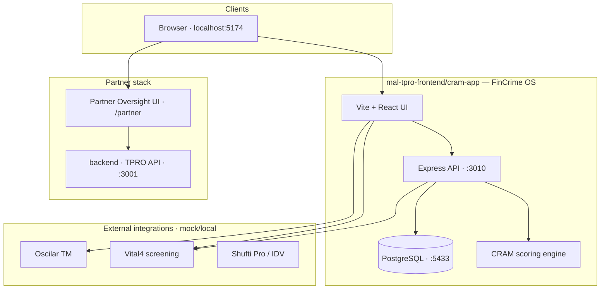

# Mal Platform — Third-Party Risk & FinCrime OS

Monorepo for **Mal** financial-crime compliance: CRAM scoring, transaction monitoring, regulatory management, partner oversight, and corridor EWRA.

**Default branch:** `main` · **Stable releases:** tagged on `main` · **Active work:** feature branches → PR → `main`

---

## Quick start

```bash
git clone git@github.com:tayelmohamed-ctrl/Third-party-risk-and-oversight-platform.git
cd Third-party-risk-and-oversight-platform
```

Full restore steps: **[SETUP.md](./SETUP.md)** · Documentation index: **[docs/README.md](./docs/README.md)**

### FinCrime OS (primary app)

```bash
cd mal-tpro-frontend/cram-app
cp .env.example .env && npm install
npm run db:up && npm run db:migrate && npm run dev
```

Open **http://localhost:5174**

---

## Architecture



---

## Repository layout

| Path | Purpose |
|------|---------|
| [`mal-tpro-frontend/cram-app/`](./mal-tpro-frontend/cram-app/) | **FinCrime OS** — CRAM engine, TM, regulatory management, investigations |
| [`mal-tpro-frontend/cram-app/docs/`](./mal-tpro-frontend/cram-app/docs/) | Product & engineering runbooks (CRAM build spec, corridor EWRA, partner integration) |
| [`mal-tpro-frontend/`](./mal-tpro-frontend/) | Legacy standalone partner shell (Vite :5173) |
| [`backend/`](./backend/) | **TPRO API** — controls, cases, reg-changes (Docker :3001) |
| [`.partnerships-extract/`](./.partnerships-extract/) | Partner contracts & DD documents (confidential — private repo only) |
| [`docs/`](./docs/) | Repo-level docs — branching, contributing, doc index |
| [`.github/`](./.github/) | Issue & PR templates |

---

## Key modules (FinCrime OS)

| Module | Route | Agent |
|--------|-------|-------|
| CRAM Risk Test Bench | `/test-bench` | Sayed |
| Transaction Monitoring & Purpose codes | `/transaction-monitoring` | Mohsen |
| Regulatory Management / Corridor EWRA | `/regulatory-management` | Sayed |
| Partner Oversight | `/partner` | — |
| Investigation Hub | `/investigation` | Mohsen |
| Reporting Centre | `/reporting` | Jana |

---

## Branch strategy

| Branch | Use |
|--------|-----|
| **`main`** | Stable, deployable snapshot — merge via PR only |
| **`feature/*`** | New features (e.g. `feature/tm-purpose-catalog`) |
| **`fix/*`** | Bug fixes |

Details: **[docs/branching.md](./docs/branching.md)**

---

## Verify

```bash
cd mal-tpro-frontend/cram-app
npm test        # unit & golden vectors
npm run build   # production build
```

---

## License & confidentiality

Internal Mal use. Partner documents in `.partnerships-extract/` are confidential — keep this repository **private**.
